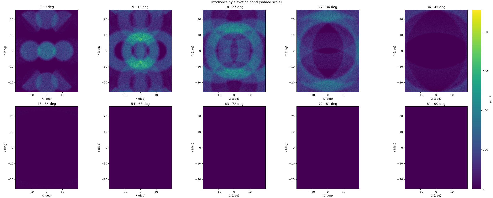
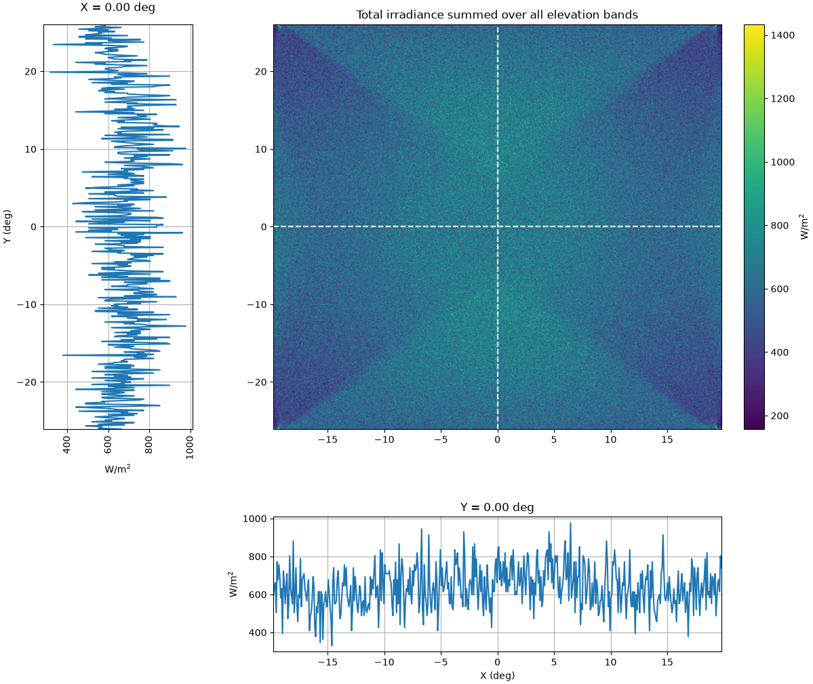

# ansys-speos-plot

Parse an **Ansys SPEOS irradiance cross-section** TXT file and produce
matplotlib figures.

## Input format

A SPEOS-exported TXT with a short header, then space-separated irradiance
matrices under heading lines like `N - M degrees`. See `example/`.

## Scripts

| Script | What it plots |
|---|---|
| `plot_channels.py` | One subplot per elevation band (shared colour scale) |
| `plot_irradiance.py` | Summed irradiance map + horizontal/vertical centre-line cuts |

## Example outputs

| Channels plot | Irradiance + cuts plot |
|---|---|
|  |  |

## Arguments

```
positional:
  path                  Path to .txt file

optional:
  --cmap CMAP           Matplotlib colormap (default: viridis)
  --save [FILE]         Save to file instead of showing (default: plot.png)
```

## Use with your own data

1. Export an irradiance cross-section from SPEOS as `.txt`.
2. Run either script:

```bash
python plot_channels.py your_data.txt
python plot_irradiance.py your_data.txt --cmap magma --save my_plot.png
```
