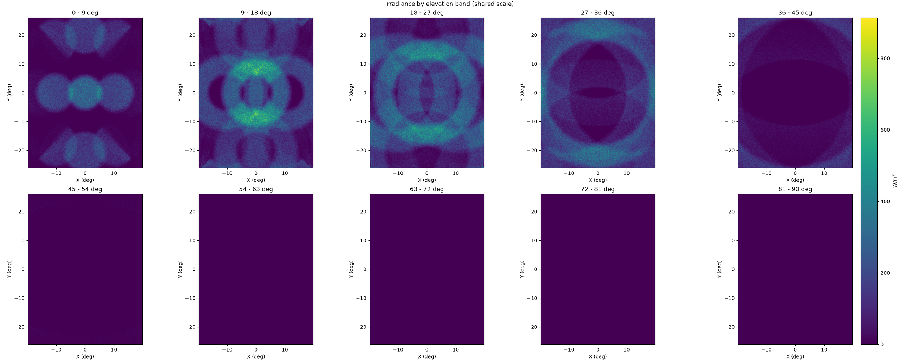
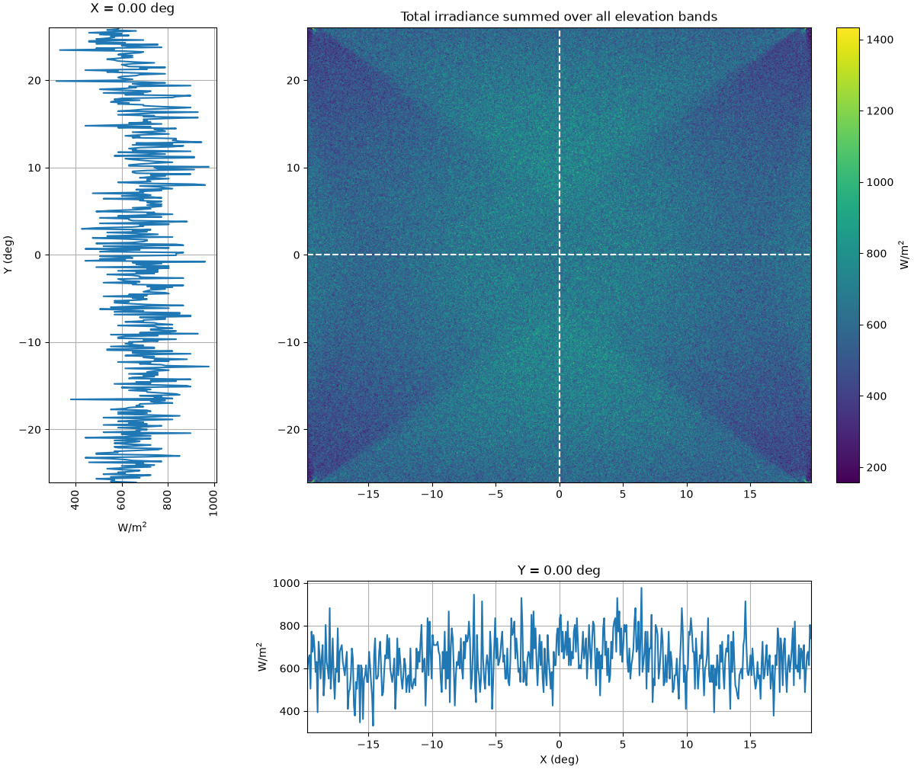

# ansys-speos-plot

Parse an **Ansys SPEOS irradiance cross-section** TXT file and produce
matplotlib figures.

## Input format

A SPEOS-exported TXT with a short header, then space-separated irradiance
matrices under heading lines like `N - M degrees`. See `example/`.

The header layout follows the [Ansys SPEOS TXT map file format]
(https://ansyshelp.ansys.com/public/Views/Secured/corp/v2521/en/Optis_UG_LAB/Optis/UG_Lab/txt_file_format_160517.html).
In particular, header line 3 is the exported map's `UnitType`
(0 = radiometric, 1 = photometric), which is how the value-unit label
(W/m^2 or lm/m^2) is auto-detected, and header line 4 is the `AxisUnit`,
which sets the axis labels.

## Usage

1. Export an irradiance cross-section from SPEOS as `.txt`.
2. Run the entry point:

```bash
# process all .txt files in ./data/ (auto-detected)
python main.py

# process a single file
python main.py --path your_data.txt
```

Arguments:

```
optional:
  --path PATH, -p PATH  Path to .txt file (default: auto-detect all .txt under ./data/ recursively)
  --cmap CMAP           Matplotlib colormap (default: viridis)
  --ylabel LABEL        Value-unit label (default: auto-detected from the file, W/m^2 or lm/m^2)
  --save [FILE]         Save to file instead of showing (default: plot.png)
```

Without `--save`, figures are written to `./figures/` under a subdirectory
named after the input file -- e.g. `./data/plane.txt` produces
`./figures/plane/channels.png` and `./figures/plane/irradiance.png`.

## Example outputs

| Channels plot                     | Irradiance + cuts plot                |
| --------------------------------- | ------------------------------------- |
|  |  |
